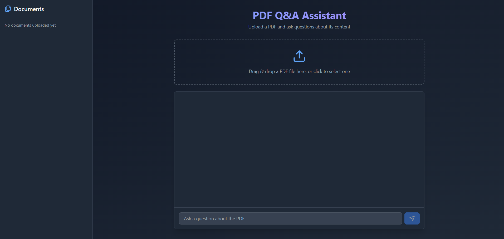
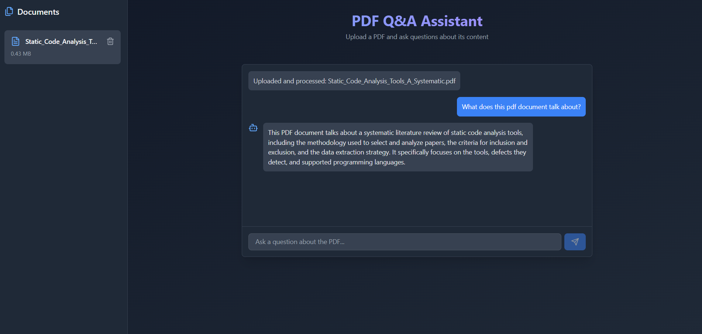

# PDF Q&A Assistant

A full-stack AI-powered web application that lets you upload a PDF and ask questions about its content. It uses state-of-the-art 
NLP techniques—Retrieval Augmented Generation (RAG), vector databases, and large language models (LLMs)—to provide accurate, 
context-aware answers from your documents.

## Features

- **PDF Upload:** Drag and drop or select a PDF to analyze.
- **Conversational Q&A:** Ask natural language questions about the uploaded PDF.
- **AI-Powered Answers:** Uses a large language model (LLM) and vector database for context retrieval and accurate responses.
- **Modern UI:** Clean, responsive interface with real-time chat and document management.
- **Document Management:** Easily remove or replace uploaded PDFs.

## How It Works
This app implements a Retrieval Augmented Generation (RAG) pipeline:

- **PDF Upload & Parsing:**
The user uploads a PDF. The backend uses LangChain’s PyPDFLoader to extract and parse the text.
- **Text Splitting:**
The text is split into manageable “chunks” using RecursiveCharacterTextSplitter to ensure each chunk fits within the LLM’s context window and preserves semantic meaning.
- **Embeddings:**
Each chunk is converted into a high-dimensional vector (embedding) using HuggingFace’s sentence-transformers/all-mpnet-base-v2 model. Embeddings capture the semantic meaning of text, allowing for similarity search.
- **Vector Database (Pinecone):**
The embeddings and their metadata are stored in a Pinecone vector database. Pinecone enables fast, scalable, and efficient similarity search across all document chunks.
- **Question Answering:**
When a user asks a question, the backend:
  * Converts the question into an embedding.
  * Searches Pinecone for the most similar document chunks (semantic search).
  * Passes the retrieved context and the question to a Large Language Model (LLM) via the Groq API (using Llama 3.3-70B).
  * The LLM is instructed to answer only using the provided context, ensuring factual and document-grounded responses.
- **Frontend:**
The React frontend provides a modern chat interface, file upload, and displays answers in real time.

## Tech Stack & Key Concepts
### LangChain
* An open-source framework for building LLM-powered applications, especially those that need to interact with external data (like PDFs).
* Handles document loading, text splitting, embedding, and retrieval logic.
* LangChain Docs
### PDFLoader
* A LangChain utility for extracting text from PDF files, supporting multi-page documents and metadata.
* Text Splitting
* RecursiveCharacterTextSplitter splits long texts into overlapping chunks, preserving context and maximizing LLM effectiveness.
### HuggingFace Embeddings
* Uses pre-trained models (e.g., sentence-transformers/all-mpnet-base-v2) to convert text into dense vectors that capture semantic meaning.
* HuggingFace Embeddings in LangChain
### Pinecone (Vector Database)
* Stores and indexes embeddings for fast similarity search.
* Enables semantic search: finding document chunks most relevant to a user’s question.
* Pinecone + LangChain Integration
### RAG (Retrieval Augmented Generation)
* A pattern that combines LLMs with external knowledge sources (like your PDFs) for more accurate, up-to-date, and context-aware answers.
* RAG explained
### Groq API (LLM Inference)
Provides ultra-fast, low-latency inference for large language models (e.g., Llama 3.3-70B).
The backend sends the user’s question and retrieved context to the LLM via Groq’s API.
What is Groq?
### FastAPI
* A modern, high-performance Python web framework for building APIs.
* Handles file uploads, question answering, and communication with the frontend.
### React + Tailwind CSS
* The frontend is built with React (JSX) for a dynamic, responsive UI.
* Tailwind CSS provides utility-first styling for a modern look and feel.

## Getting Started

### Prerequisites
* Node.js (for frontend)
* Python 3.8+ (for backend)
* Pinecone account (or another vector DB)
* Groq API key (or other LLM provider)
* HuggingFace model (for embeddings)

1. Clone the Repository
```bash
git clone https://github.com/3N-VOY/aipdf.git
cd aipdf
```

2. Setup the Backend
Configure your environment variables (API keys, Pinecone, Groq, etc.) in a .env file.
```bash
cd backend
python -m venv venv
source venv/bin/activate  # On Windows: venv\Scripts\activate
pip install -r requirements.txt
```
Start the FastAPI server:
By default, the backend runs at http://localhost:8000.
```bash
uvicorn main:app --reload
```

3. Setup the Frontend
```bash
cd ../frontend
npm install
npm run dev 
```
The frontend will run at http://localhost:3000 (or another port if specified).

4. Usage
Open the frontend in your browser.
Upload a PDF using the sidebar.
Ask questions about the document in the chat box.
View AI-generated answers and context.

## Configuration
* Backend:
  * Set your LLM and Pinecone API keys in environment variables or a .env file.
  * Adjust chunk size, retrieval count, or prompt templates in main.py as needed.
* Frontend:
  * The backend URL is set in App.jsx (BACKEND_URL). Change if deploying elsewhere.
 
## Troubleshooting
* Long filenames overflow sidebar:
Filenames are truncated with ellipsis and full name shown on hover.
* Backend errors:
Check API keys, Pinecone namespace, and server logs for details.
* LLM not using context:
Ensure prompt templates and retrieval logic are set up as described in the backend code.

## Screenshots
### Main UI


### Chatting with the LLM



## References
* [LangChain Documentation](https://python.langchain.com/docs/introduction/)
* [Pinecone Docs](https://docs.pinecone.io/integrations/langchain)
* [Groq API Overview](https://console.groq.com/docs/overview)
* [HuggingFace Embeddings](https://huggingface.co/blog/getting-started-with-embeddings)
* [RAG with Pinecone, LangChain, and OpenAI Further Reading](https://medium.com/@3rdSon/how-to-build-rag-applications-with-pinecone-serverless-openai-langchain-and-python-d4eb263424f1)
* [Implementing RAG with Langchain and Hugging Face](https://medium.com/@akriti.upadhyay/implementing-rag-with-langchain-and-hugging-face-28e3ea66c5f7)


## Contributions and feedback are welcome!
If you have questions or want to improve the project, feel free to open an issue or pull request.

## Author
Developed by 3N-VOY (Alexander Xagoraris)
